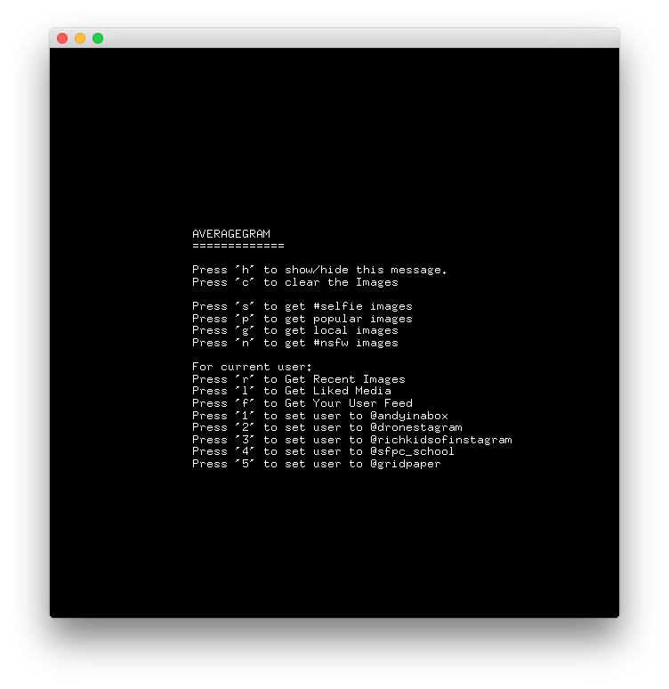
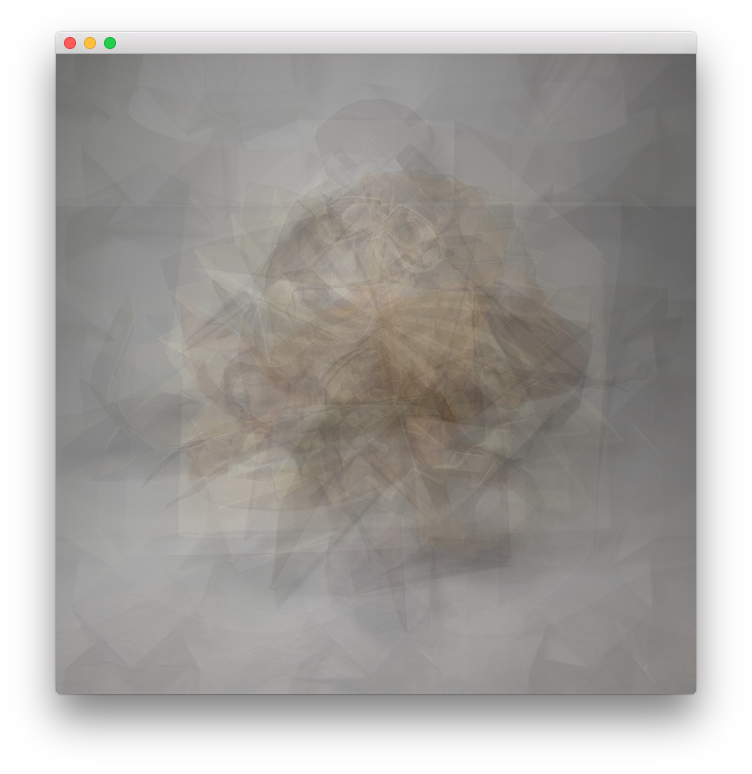

averagegram
==============

Averaging images from the Instagram API.

Usage
-----

Examples
--------

These are early examples using samples with 20 images.

### Popular Images

### Images tagged "#selfie"

### Images near 155 Bank St., NY

### User: [@dronestagram](https://instagram.com/dronestagram/)

### User: [@richkidsofinstagram](https://instagram.com/richkidsofinstagram/)

### User: [@gridpaper](https://instagram.com/gridpaper/)
